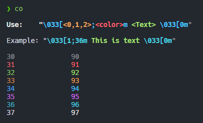

# Ansii Color Codes Uitlity

This C program provides you with a quick guide to the ANSI colour codes that you can use on the terminal. It does not print text on the screen, but displays the numbers corresponding to the ANSI colour codes along with their visual representation on the terminal.
